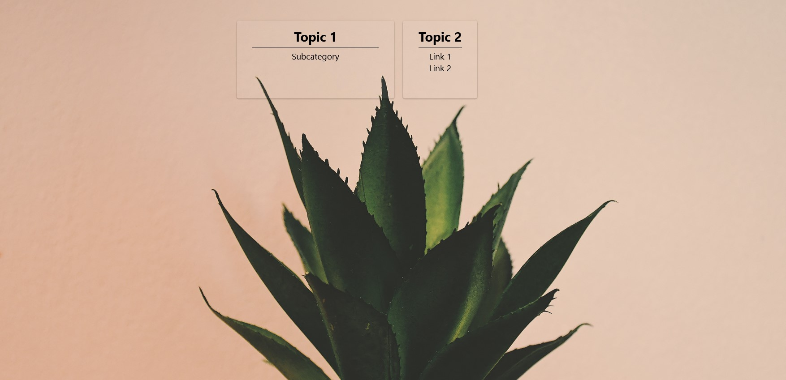
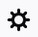
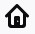

# Hobu

Create a custom start page for your browser.

## Installation
1. [Download the Hobu.html file](https://gitlab.com/nimalu/hobu/-/raw/master/hobu.html?inline=false)
3. Save the file somewhere you can remember
4. (Optional) Choose a background image, save it in the same folder and name it `background.jpg`
5. Set the downloaded html file as your start page. This is how it's done in firefox:
   1. Copy the path of the html file
   2. Open the menu by clicking on 
   3. Select settings 
   4. On the left select `Home` 
   5. Paste the path under `Homepage and new windows` (Alternatively, you can open the html file with firefox and click on `Use Current Page`)
6. Voilà! Now, if you open your browser, you should see Hobu.

## Configuration
- Move cards via dragging
- New Cards via right-click
- Edit/Delete cards via right-click
- **IMPORTANT**: To keep changes you made you have to download the file via right-click > download and overwrite the existing html file
